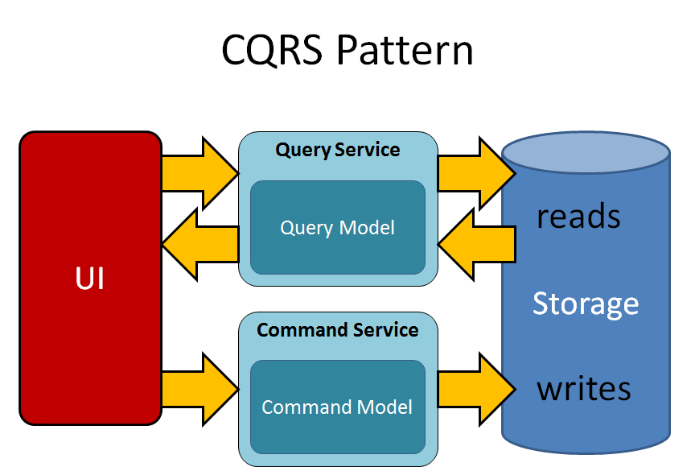

## Necessity of CQRS in financial softwares
There are beautiful concepts in commandbus and eventbus. I remember reading an important sentence: 
"Commands are often used in applications that separate the technical aspects of user input from their 
meaning inside the application. Commands in object-oriented programming are objects, like everything else. 
A command is literally some kind of an imperative, indicating what behavior a user, or client, 
expects from the application."
I always make a decision based on CAP theorem. Well Accounting is for past tense
so leave it to the read side and you eventually get consistency, but in financial 
softwares the deal with transaction we care more about consistency rather
than availability. 
Command pattern is useful if you want to use a rich domain in Domain Driven Design rather than
using many services and reduce the importance of domain up to a simple table.
The command dispatcher is just one task of Command bus. Command bus can also 
be used for command history storing for advanced analysis. It can also be
used for caching. Here the motivation for me is supporting open close principle as well
as a beautiful loose coupling between presentation layer and the domain layer.
So everything is a plugin and the code reusability is achieved because the commandhandler
is still using the domain methods! 

## CommandHandler for CQRS


## What should the protocol buffer message contain?
It is compulsory to have:
* aggregateId:
This is the id of your aggregate root
* aggregateType:
This is the type of aggregate root(className). It is necessary
since the command dispatcher needs to detect it(the protobuf message) to decide which commandHandler
is appropriate for it.
* payload
* version
* timestamp
```java_holder_method_tree
 Share share = context.getBean(Share.class); // receiver
        AbstractCommandListener buyShareCommand = new BuyShareCommand(share); // concrete command
        AbstractCommandListener sellShareCommand= new SellShareCommand(share); //concrete command
        Invoker invoker=new Invoker(buyShareCommand);// invoker
        if (name.equals("farshadBond")){
            invoker = new Invoker(buyShareCommand);
            invoker.setCommand(buyShareCommand);
        }else{
            invoker.setCommand(sellShareCommand);
        }
        invoker.invoke(message);
``` 
### Domain experts
Domain expert just need to extend an abstract class and implement the business stuff. The infrastructure
will handle all dispatching and dirty stuff!
```jave 
@CommandHandler(ExtMessageClasses = BondProtos.Bond.class)
public class BuyShareCommand extends AbstractCommandListener<BondProtos.Bond> {

    Share share;

    public BuyShareCommand(Share share) {
        this.share = share;
    }

    @Override
    public void execute(BondProtos.Bond bond) {
        share.buy(bond.getValue());
    }
}
```

### infrastructure guys(very old Men(wearing dark black) thinking about abstract stuff and not the domain!)
```java_holder_method_tree
private HashMap<String, Class<? extends AbstractCommandListener>> registerCommandListeners() throws ClassNotFoundException {
        HashMap<String, Class<? extends AbstractCommandListener>> commandListenerList = new HashMap<>();
        Class[] messageClasses=((CommandHandler) commandListenerClass.getAnnotation(CommandHandler.class)).ExtMessageClasses();
        for (Class messageClass : messageClasses) {
            System.out.println("found listener:"+commandListenerClass.getCanonicalName());
            commandListenerList.put(messageClass.getCanonicalName(), commandListenerClass);
        }
        return commandListener;
    }
```
Well, the beauty of command design pattern is unbelievable. The magic comes from 
Invoker class that decouples two different parties! Lets have a look at it:
```java 
public class Invoker<M extends Message> {

    AbstractCommandListener abstractCommandListener;

    public Invoker(AbstractCommandListener abstractCommandListener) {
        this.abstractCommandListener = abstractCommandListener;
    }

    public void setCommand(AbstractCommandListener abstractCommandListener) {
        this.abstractCommandListener = abstractCommandListener;
    }

    public void invoke(M message) {
        abstractCommandListener.execute(message);
    }

}
```

## result
```java 
5.0 share is bought!
```